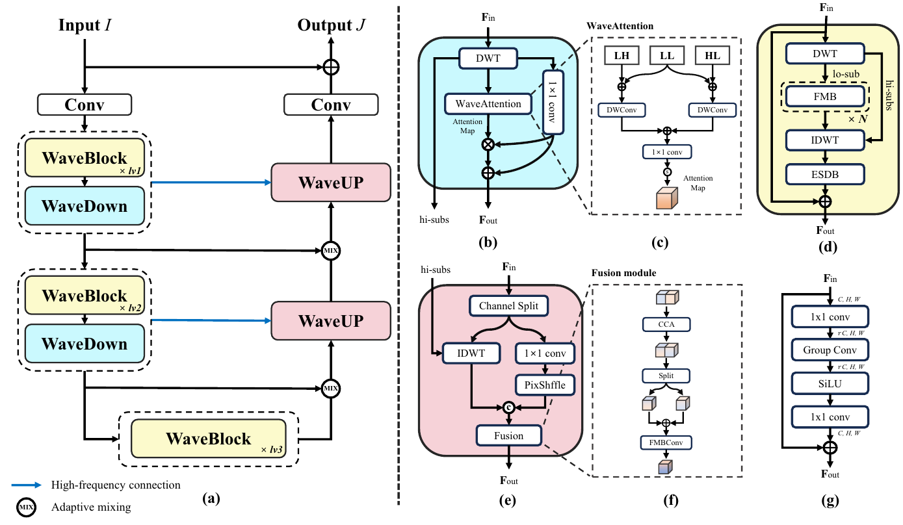

# WaveDH
[](https://arxiv.org/abs/2404.01604)

## Network Architecture
 

## Installation
```
conda create -n WaveDH python=3.10  # create a virtual env
conda activate WaveDH               # activate the env
conda install pytorch==1.13.1 torchvision==0.14.1 torchaudio==0.13.1 pytorch-cuda=11.7 -c pytorch -c nvidia
pip install -r requirements.txt     # Install other needed packages
```


## Performance
  - The benchmark results of our models can be downloaded from [WaveDH](https://gisto365-my.sharepoint.com/:f:/g/personal/sm_hwang_gm_gist_ac_kr/EqjCvWt-Sg5KhhTcxCPHLj8BXrj7piY13YUN3NJIw5MmEg?e=Ed2VhZ) and [WaveDH-tiny](https://gisto365-my.sharepoint.com/:f:/g/personal/sm_hwang_gm_gist_ac_kr/EvcqhOPBG4lHgXDTKWk2nXsBS_rixBAhkY_74mwU1C0VEg?e=R9pFUc).
  - Performance in PSNR/SSIM on SOTS-indoor and SOTS-outdoor.
  
  | Model         | SOTS-indoor  | SOTS-outdoor |
  | ------------- |:------------:|:------------:|
  | WaveDH        | 39.35/0.995  | 34.89/0.984 |
  | WaveDH-Tiny   | 36.93/0.992  | 34.52/0.983 |

## Citation
If you find this work useful in your research, please consider citing:

```
@article{hwang2024wavedh,
  title={WaveDH: Wavelet Sub-bands Guided ConvNet for Efficient Image Dehazing},
  author={Seongmin Hwang and Daeyoung Han and Cheolkon Jung and Moongu Jeon}, 
  journal={arXiv preprint arXiv:2404.01604},
  year={2024}
}
```
